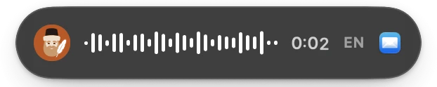
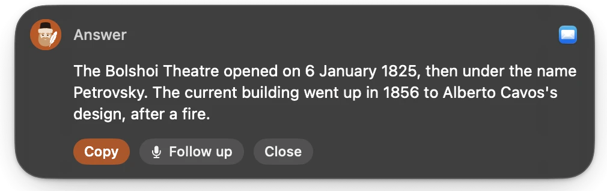
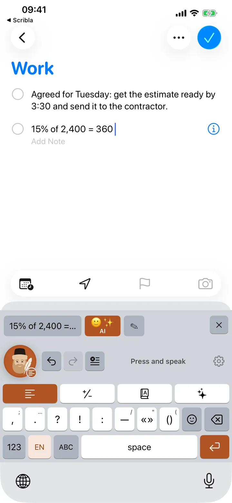
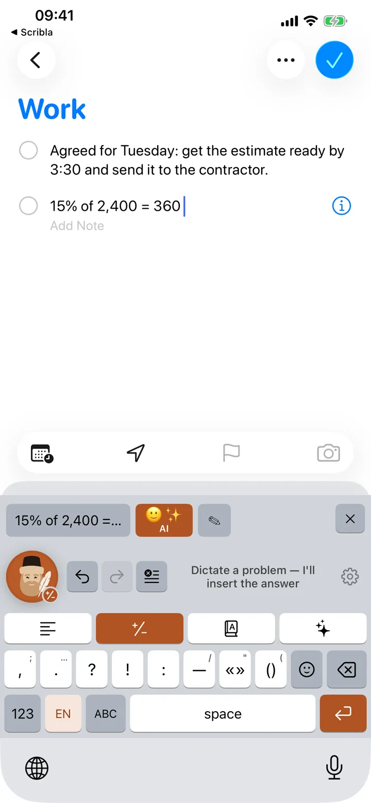
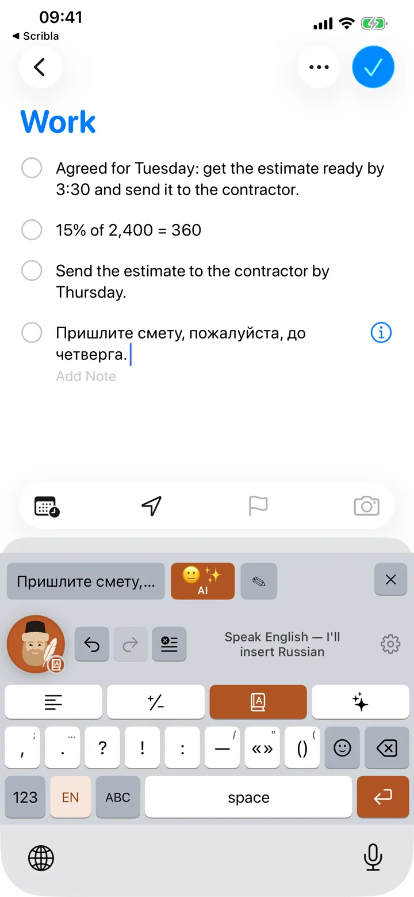
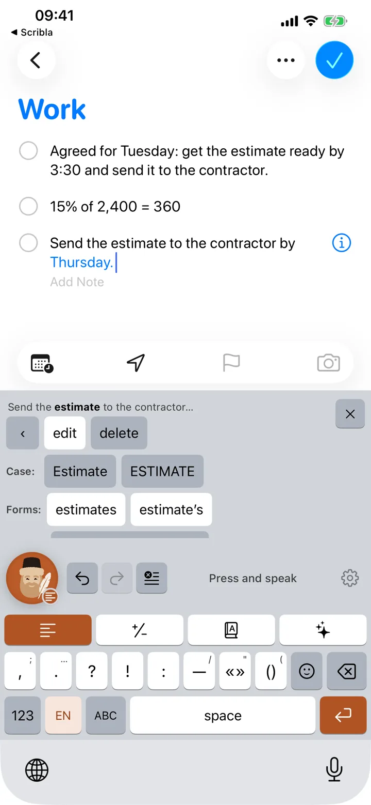
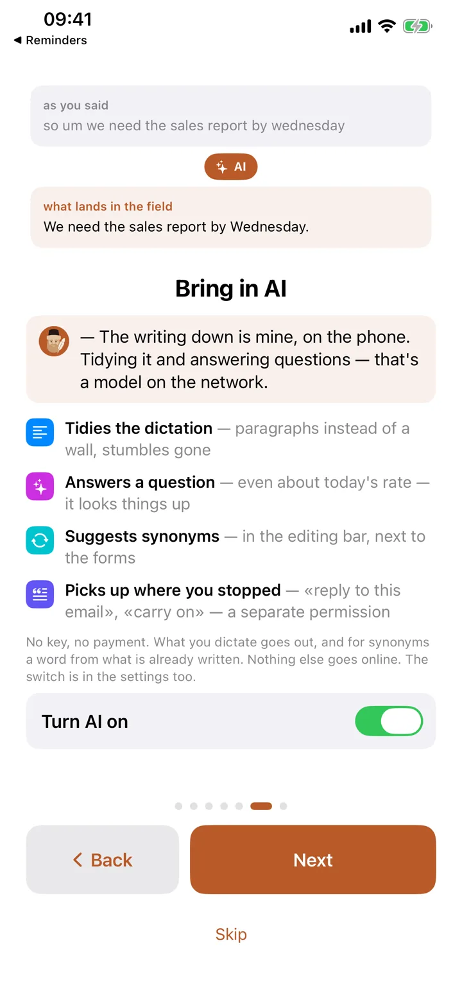
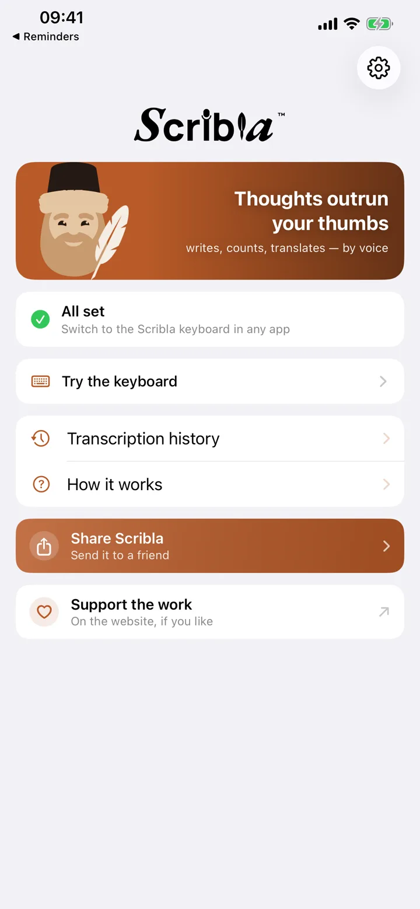

<div align="center">


# Scribla

**Dictation that writes clean — on iPhone and on Mac.**

Speak, and Scribla puts finished text into the email, note or chat: punctuated,
with the ums gone. It also counts, translates and answers questions. The audio
stays on the device.

[](https://github.com/alvlsk12345/scribla-releases/releases/latest)
[](https://apps.apple.com/app/id6800086470)
[](#install-on-mac)
[](#install-on-iphone)
[](#what-does-it-cost)

### [⬇︎ Download for Mac](https://github.com/alvlsk12345/scribla-releases/releases/latest/download/Scribla-1.0.5.dmg) &nbsp;·&nbsp; [ Get it on iPhone](https://apps.apple.com/app/id6800086470) &nbsp;·&nbsp; [scribla.io](https://scribla.io/en/)

[Русский](README.md) · [Changelog](CHANGELOG.md) · [All releases](https://github.com/alvlsk12345/scribla-releases/releases)

</div>

---

This repository is the storefront and the delivery channel: the Mac disk images
live here, along with release notes and the App Store link. The source is closed.

## What it does

Four modes. The mode decides what lands in the field, and it stays until you
change it — no need to say “calculate” or “translate”.

| Mode | You say | In the field |
|---|---|---|
| **Text** | um so hi aida good morning thanks a lot | Hi Aida, good morning! Thanks a lot. |
| **Calc** | fifteen percent of two thousand four hundred | 360 |
| **Translate** | documents received, we will reply by friday | Documentos recibidos, respondemos antes del viernes. |
| **AI** | reply that thursday does not work and suggest friday | Unfortunately, Thursday does not work for me. Could we move the meeting to Friday? |

A “sounds like → spelled as” dictionary fixes names and terms for good: correct
“en dee ay” once and it is NDA from then on.

Four languages — English, Russian, Spanish, Chinese — recognised on the device
itself, offline included.

## On the Mac

An icon in the menu bar. Hold the right ⌘ and speak: the text lands at the cursor
in any window. ⌘ + ⌥ answers what you said; add **/** for a translation.

<picture>
  <source media="(prefers-color-scheme: dark)" srcset="docs/img/mac/hud-rec-en-dark.webp">
  
</picture>
<picture>
  <source media="(prefers-color-scheme: dark)" srcset="docs/img/mac/hud-answer-en-dark.webp">
  
</picture>

There is nothing to switch to: the app hears its key in any window. No emoji or
word-by-word edit panels here — you have a real keyboard.

## On the iPhone

Scribla is a keyboard: switch to it and tap the scribe. The text lands in the
field by itself, and if a word came out wrong, the edit bar is right there —
you change one word, not the whole phrase.

| Dictation | Calc | Translate |
|:--:|:--:|:--:|
|  |  |  |
| **Word-by-word edit** | **AI mode** | **The app** |
|  |  |  |

## Install on Mac

1. [Download the image](https://github.com/alvlsk12345/scribla-releases/releases/latest) —
   or from the site at the permanent address [scribla.io/download/Scribla.dmg](https://scribla.io/download/Scribla.dmg).
2. Open it and drag Scribla to Applications.
3. Allow the microphone and Accessibility when macOS asks.

The image is signed with a Developer ID certificate and notarized by Apple: it
opens with a double click, with no Gatekeeper detour.

| | |
|---|---|
| Version | **1.0.5** (build 22) |
| System | macOS 14 or later, Apple Silicon and Intel |
| Size | 25.2 MB |
| SHA-256 | `50f152680340e6b02944a23fe922164720ddeeed8a601d14cd5685c19eaf13b9` |

Check the digest with one line:

```bash
shasum -a 256 ~/Downloads/Scribla-1.0.5.dmg
```

The installed app checks for updates and installs them itself, accepting an image
only if it carries our signature and Apple’s notarization. Its source is
scribla.io; the same image and the same notes are here.

## Install on iPhone

[App Store](https://apps.apple.com/app/id6800086470) — iOS 17 or later, no
sign-up. Then three steps, and the first one only once:

1. **Enable the keyboard.** Settings → General → Keyboard → Keyboards → Scribla.
2. **Tap the scribe** in any text field: messenger, mail, notes, search.
3. **Speak.**

The keyboard asks for Full Access for exactly one thing: to read the recognised
text from the shared container, where the Scribla app itself put it. iOS offers
no other way to get text into a keyboard.

## Versions

| | Current | Where to get it | What changed |
|---|---|---|---|
| **Mac** | 1.0.5 | [GitHub Releases](https://github.com/alvlsk12345/scribla-releases/releases/latest) · [scribla.io](https://scribla.io/download/Scribla.dmg) | [Changelog](CHANGELOG.md#mac) |
| **iPhone** | 1.2.1 | [App Store](https://apps.apple.com/app/id6800086470) | [Changelog](CHANGELOG.md#iphone) |

How it works: every Mac release gets a `mac-v<version>` tag and a release holding
the disk image. Releases exist for the Mac only, so `releases/latest` always
points at the newest image. iPhone versions ship through the App Store and land
here as an entry in [CHANGELOG.md](CHANGELOG.md).

## Privacy

Your phone or Mac does the listening — the recording never leaves the device, so
there is nothing for a server to keep. In AI modes only the text of your question
leaves: to scribla.io and on to the model. Neither question nor answer is stored,
and the modes switch off in Settings. No account, no ads, no trackers.

[Full privacy policy](https://scribla.io/privacy.html)

## What does it cost

Nothing at the moment — everything is open, the AI modes included: answers, web
search and polish. The key is ours and the bill for the model comes to us; no
subscription, no account, no card. Whether anything becomes paid will be decided
later and on the evidence. If that day comes, we will say so in advance rather
than on the morning it happens.

## Something isn’t working

Common breakages — microphone, Full Access, an empty field — are collected on the
[support page](https://scribla.io/support.html). If yours isn’t there, write to
[dev@scribla.io](mailto:dev@scribla.io).

---

<div align="center">
<sub>© LLC ASCBS · <a href="https://scribla.io/en/">scribla.io</a> · The app is proprietary; only builds and their notes live here.</sub>
</div>
