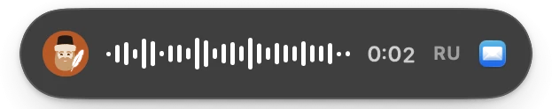
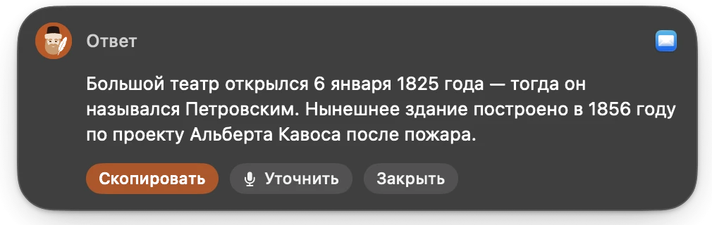
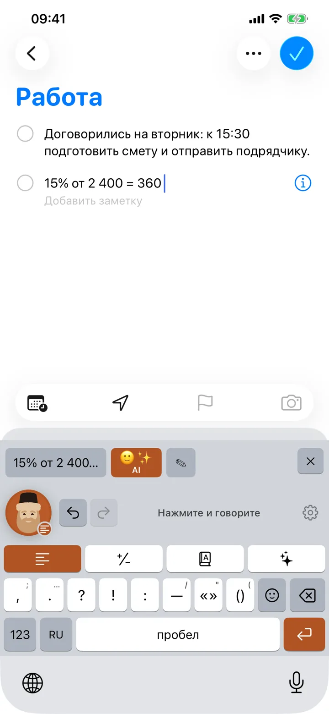
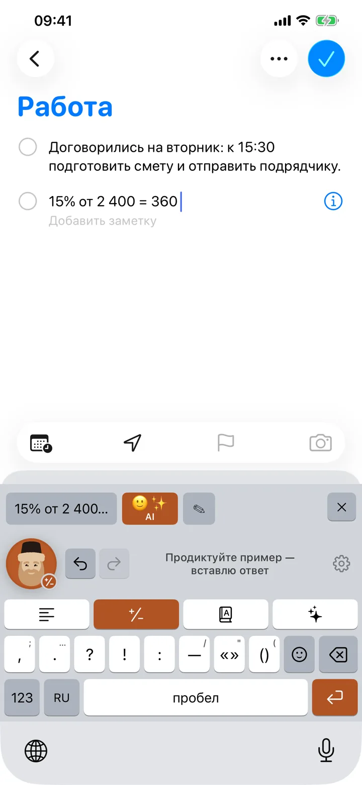
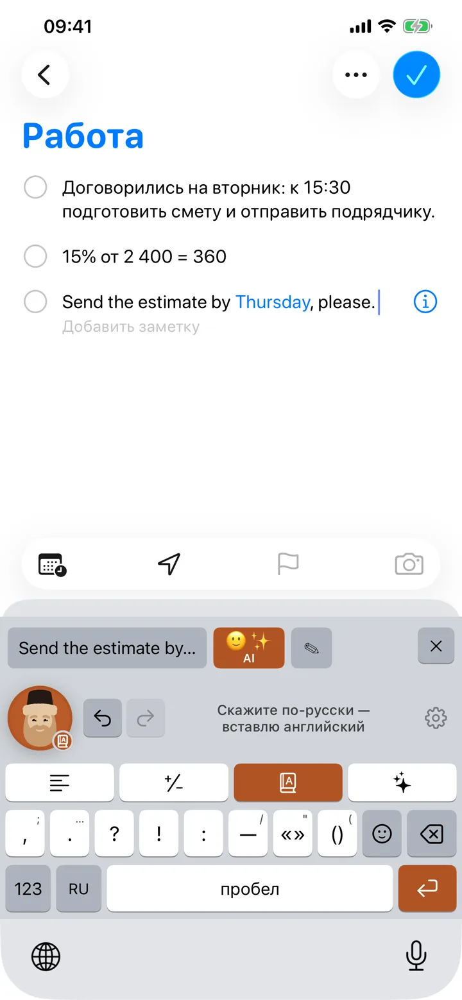
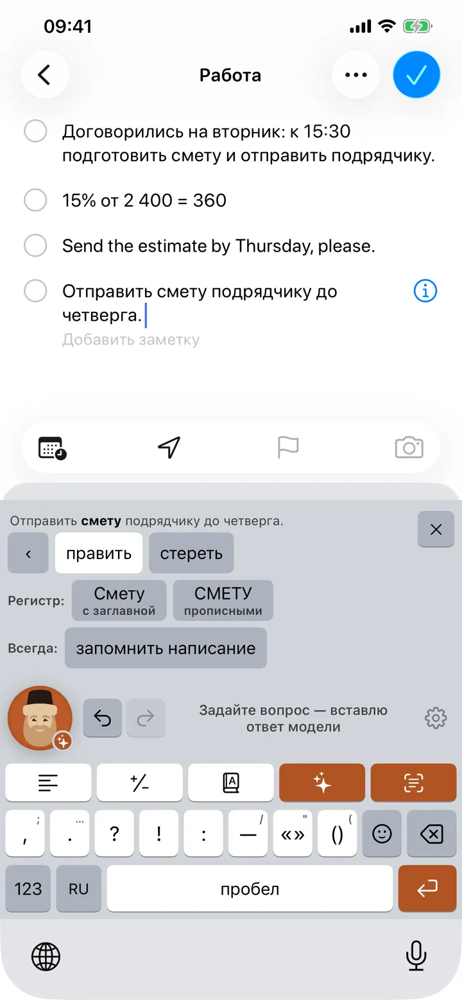
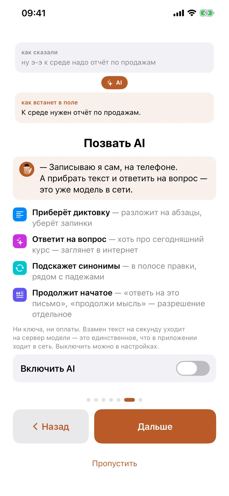
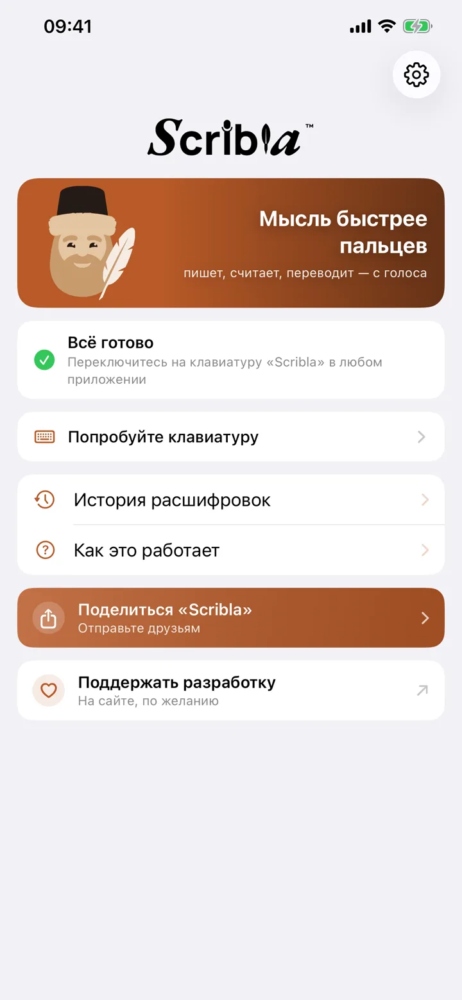

<div align="center">


# Scribla

**Диктовка, которая пишет чисто — на iPhone и на Mac.**

Говорите — Scribla ставит готовый текст в письмо, заметку или чат: со знаками,
без «э-э». Считает, переводит, отвечает на вопрос. Звук остаётся на устройстве.

[](https://github.com/alvlsk12345/scribla-releases/releases/latest)
[](https://apps.apple.com/app/id6800086470)
[](#установка-на-mac)
[](#установка-на-iphone)
[](#сколько-это-стоит)

### [⬇︎ Скачать для Mac](https://github.com/alvlsk12345/scribla-releases/releases/latest/download/Scribla-1.0.5.dmg) &nbsp;·&nbsp; [ Установить на iPhone](https://apps.apple.com/app/id6800086470) &nbsp;·&nbsp; [scribla.io](https://scribla.io)

[English](README.en.md) · [История версий](CHANGELOG.md) · [Все выпуски](https://github.com/alvlsk12345/scribla-releases/releases)

</div>

---

Этот репозиторий — витрина и канал раздачи: здесь лежат образы маковой версии,
заметки к выпускам и ссылка на App Store. Исходники закрыты.

## Что она делает

Четыре режима. Режим решает, что встанет в поле, и держится, пока его не сменят —
говорить «посчитай» или «переведи» не нужно.

| Режим | Сказали | В поле |
|---|---|---|
| **Текст** | ну э-э аида доброе утро спасибо большое | Аида, доброе утро! Спасибо большое. |
| **Счёт** | пятнадцать процентов от двух тысяч четырёхсот | 360 |
| **Перевод** | документы получены, ответим до пятницы | The documents have been received, we will reply by Friday. |
| **AI** | ответь что в четверг не получится предложи пятницу | К сожалению, в четверг не получится. Предлагаю перенести встречу на пятницу. |

Словарь «слышится → пишется» чинит имена и термины раз и навсегда: поправили
«эн-ди-эй» один раз — дальше всегда NDA.

Четыре языка: русский, английский, испанский, китайский. Распознавание идёт
на самом устройстве, в том числе без интернета.

## На Mac

Значок в строке меню. Держите правый ⌘, говорите — текст встаёт под курсор
в любом окне. ⌘ + ⌥ — ответ на сказанное, с нажатым **/** — перевод.

<picture>
  <source media="(prefers-color-scheme: dark)" srcset="docs/img/mac/hud-rec-ru-dark.webp">
  
</picture>
<picture>
  <source media="(prefers-color-scheme: dark)" srcset="docs/img/mac/hud-answer-ru-dark.webp">
  
</picture>

Переключаться никуда не надо: приложение слышит клавишу в любом окне.
Панелей эмодзи и правки по словам здесь нет — у вас настоящая клавиатура.

## На iPhone

Scribla — клавиатура: переключились на неё и нажали на Дьяка. Текст встаёт
в поле сам, а если распознало не то — полоса правки рядом, слово меняется
отдельно.

| Диктовка | Счёт | Перевод |
|:--:|:--:|:--:|
|  |  |  |
| **Правка по словам** | **Режим AI** | **Приложение** |
|  |  |  |

## Установка на Mac

1. [Скачайте образ](https://github.com/alvlsk12345/scribla-releases/releases/latest) —
   или с сайта по вечному адресу [scribla.io/download/Scribla.dmg](https://scribla.io/download/Scribla.dmg).
2. Откройте его и перетащите Scribla в «Программы».
3. Разрешите микрофон и Универсальный доступ — macOS спросит сама.

Образ подписан сертификатом Developer ID и заверен у Apple: открывается
двойным щелчком, без обхода Gatekeeper.

| | |
|---|---|
| Версия | **1.0.5** (сборка 22) |
| Система | macOS 14 и новее, Apple Silicon и Intel |
| Размер | 25,2 МБ |
| SHA-256 | `50f152680340e6b02944a23fe922164720ddeeed8a601d14cd5685c19eaf13b9` |

Отпечаток проверяется одной строкой:

```bash
shasum -a 256 ~/Downloads/Scribla-1.0.5.dmg
```

Установленное приложение само проверяет обновления и ставит их, приняв образ
только с нашей подписью и заверением Apple. Источник у него — scribla.io;
здесь лежит тот же образ и заметки к выпуску.

## Установка на iPhone

[App Store](https://apps.apple.com/app/id6800086470) — iOS 17 и новее,
без регистрации. Дальше три шага, и первый только один раз:

1. **Включить клавиатуру.** Настройки → Основные → Клавиатура → Клавиатуры → Scribla.
2. **Нажать на Дьяка** в любом поле ввода: мессенджер, почта, заметки, поиск.
3. **Говорить.**

Клавиатура просит полный доступ ровно для одного: прочитать распознанный текст
из общего хранилища, куда его положило само приложение Scribla. Другого способа
доставить текст в клавиатуру iOS не даёт.

## Версии

| | Свежая версия | Где брать | Что изменилось |
|---|---|---|---|
| **Mac** | 1.0.5 | [GitHub Releases](https://github.com/alvlsk12345/scribla-releases/releases/latest) · [scribla.io](https://scribla.io/download/Scribla.dmg) | [CHANGELOG](CHANGELOG.md#mac) |
| **iPhone** | 1.2.1 | [App Store](https://apps.apple.com/app/id6800086470) | [CHANGELOG](CHANGELOG.md#iphone) |

Как это устроено: каждый выпуск для Mac получает тег `mac-v<версия>` и релиз
с образом-приложением. Релизы заводятся только для Mac, поэтому
`releases/latest` всегда указывает на свежий образ. Версии для iPhone выходят
в App Store и попадают сюда записью в [CHANGELOG.md](CHANGELOG.md).

## Приватность

Речь разбирает сам телефон или мак — запись не покидает устройство, и серверу
нечего хранить. В режимах с AI уходит только текст вопроса: на scribla.io,
оттуда к модели. Ни вопрос, ни ответ не сохраняются, а сами режимы выключаются
в настройках. Ни аккаунта, ни рекламы, ни трекеров.

[Политика приватности целиком](https://scribla.io/privacy.html)

## Сколько это стоит

Сейчас нисколько — открыто всё, и режимы с AI тоже: ответы, поиск в интернете
и полировка. Ключ наш, счёт за модель приходит нам; ни подписки, ни регистрации,
ни карты. Появится ли что-то платное, решится позже и по делу. Если такой день
настанет, скажем заранее, а не в день включения.

## Что-то не работает

Разбор частых поломок — микрофон, полный доступ, пустое поле — собран
на [странице поддержки](https://scribla.io/support.html). Если вашего случая
там нет, напишите: [dev@scribla.io](mailto:dev@scribla.io).

---

<div align="center">
<sub>© LLC ASCBS · <a href="https://scribla.io">scribla.io</a> · Приложение проприетарное; здесь только сборки и заметки к ним.</sub>
</div>
